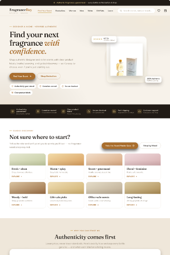

# FragranceBuy: Deals vs. Discovery · Direction B (Trust + Discovery)

**A calmer, guidance-led homepage concept for FragranceBuy.ca, for shoppers who know how they want to smell but not what the bottle is called.**

[**Live prototype**](https://fragrancebuy-redesign-protoype-b.vercel.app/) · [**Case study**](https://www.szn4.design/fragrancebuy-deals-vs-discovery/) · [Direction A (Deal-led)](https://github.com/SZN4Design/Fragrancebuy-redesign)



## The idea

Sometimes the sticking point isn't price. It's *"Will I like it? Is it real? What's a tester?"* This direction tests the hypothesis that **if shoppers can explore by scent and get those answers early, they'll browse deeper and feel confident enough to buy.**

It's the second half of a two-direction CRO study. [Direction A](https://github.com/SZN4Design/Fragrancebuy-redesign) tests the opposite: making the deal impossible to miss.

## What's in the page

- **Scent Finder:** discovery starts with words people actually use (fresh, warm, sweet, floral) instead of brand names
- **Authenticity and formats explained:** why it's cheaper, whether it's real, what a tester is
- **Best Blind Buys:** product cards with scent cues that make an unfamiliar fragrance easier to imagine
- Education, reviews, shipping reassurance and an FAQ layered through the page
- Mobile "Shop by Mood" carousel and slide-in menu

### Built-in review tools

A floating **Prototype B** dock (bottom-right) toggles:

- **Desktop / Mobile preview**
- **A/B annotations** explaining the CRO reasoning behind each section
- **Metrics panel** showing the KPIs this layout is designed to move

## Measurement plan

| | |
|---|---|
| **Primary metric** | Conversion rate for new visitors |
| **Supporting signals** | Scent Finder clicks, quiz starts, education and review engagement, add-to-cart from discovery modules |
| **Guardrail** | Bounce rate, for shoppers who just wanted the deal |

This is a proposed plan. No live A/B test was run.

## Built with

Vanilla HTML, CSS and JavaScript in a single `index.html`, with no framework and no build step. Deployed on Vercel.

## Run it locally

Open `index.html` in a browser, or:

```bash
python3 -m http.server 8000
# then visit http://localhost:8000
```

## Notes

- Independent concept and portfolio piece. **Not affiliated with or endorsed by FragranceBuy.ca.**
- Prices, ratings and metrics are illustrative. Product photos are referenced from FragranceBuy's public CDN for demonstration only.

---

Designed and built by **Sabrina Mohammed** · [szn4.design](https://www.szn4.design/) · [LinkedIn](https://www.linkedin.com/in/sabrina-mohammed-31694483/)
